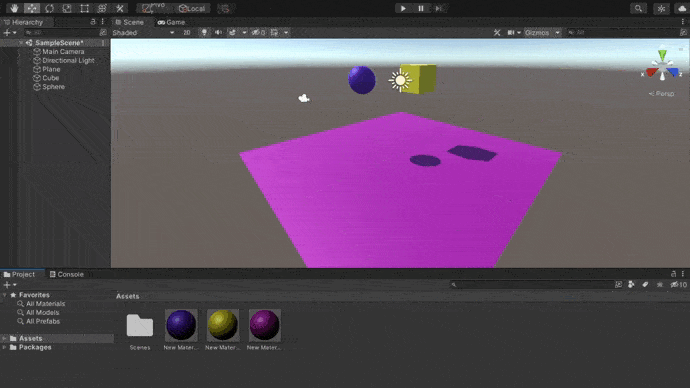
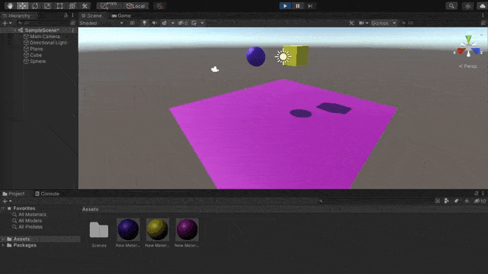

# Práctica 2: Introducción a los scripts en Unity 📌

### Esta práctica consiste en realizar tres ejercicios relacionados con los scripts en Unity.
-----------------------------------
 

### **Primer ejercicio**

1. Ninguno de los objetos es físico.
    
   
2. La esfera tiene físicas, el cubo no.
    
   
3. La esfera y el cubo tienen físicas.
    
   
4. La esfera y el cubo son físicos y la esfera tiene 10 veces la masa del cubo.
    
   
5. La esfera tiene físicas y el cubo es de tipo IsTrigger.
    
   
6. La esfera tiene físicas, el cubo es de tipo IsTigger y tiene físicas.
    
   
7. La esfera y el cubo son físicos y la esfera tiene 10 veces la masa del cubo, se impide la rotación del cubo sobre el plano XZ.
    
   

### **Segundo ejercicio**

En este segundo ejercicio trata de desarrollar una escena, donde se ubica un cubo en un plan, que con el [script](./controller.cs) que se incorpora en este repositorio, conseguimos que el cubo se mueva. En el siguiente gif podemos ver una simulación de lo desarrollado:

### **Tercer ejercicio**

--------------------
Esta práctica ha sido realizada por Nerea Rodríguez Hernández 💻, alu0101215693@ull.edu.es, alumna de Ingenería Informática en la Universidad de La Laguna para la asignatura de Interfaces Inteligentes📚.