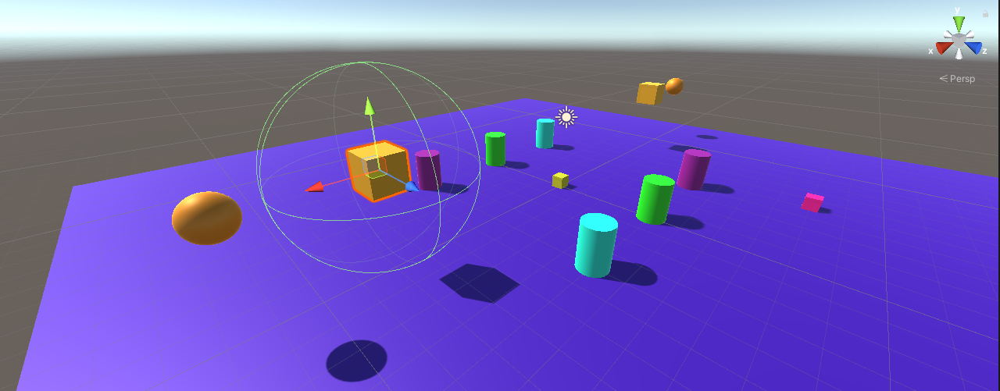

# Práctica 2: Introducción a los scripts en Unity 📌

### Esta práctica consiste en realizar tres ejercicios relacionados con los scripts en Unity.
-----------------------------------
 

### **Primer ejercicio**

1. Ninguno de los objetos es físico.
    
   
2. La esfera tiene físicas, el cubo no.
    
   
3. La esfera y el cubo tienen físicas.
    
   
4. La esfera y el cubo son físicos y la esfera tiene 10 veces la masa del cubo.
    
   
5. La esfera tiene físicas y el cubo es de tipo IsTrigger.
    
   
6. La esfera tiene físicas, el cubo es de tipo IsTigger y tiene físicas.
    
   
7. La esfera y el cubo son físicos y la esfera tiene 10 veces la masa del cubo, se impide la rotación del cubo sobre el plano XZ.
    
   

### **Segundo ejercicio**

En este segundo ejercicio trata de desarrollar una escena, donde se ubica un cubo en un plan, que con el [script](./scripts/controller.cs) que se incorpora en este repositorio, conseguimos que el cubo se mueva. En el siguiente gif podemos ver una simulación de lo desarrollado:

### **Tercer ejercicio**

En este ejercicio se plantea colocar una serie de cilindros por la escena, los cuales aumentaran su tamaño cada vez que el objeto jugador colisione con alguno de ellos y el jugador aumentará de puntuación. La implementación de esta lógica la encontramos en clicando en el script *[gameController](./scripts/gameController.cs)*.

Se han agregado cilindros del tipo general(definido en el parrafo anterior), del tipo A, donde el jugador pulsando la barra espaciadora lo mueve hacia fuera de él, y un tercer tipo de cilidro B, que se alejan del jugador cada vez que se acerque. Para el desarollo lógico de este apartado he creado un script *[cylinderController](./scripts/cylinderController.cs)*.

Se ha añadido un tercer objeto que es capaz de detectar colisiones, el cual se mueve con las teclas I, L, J, M. Es un objeto cubo de color rosa en la simulación, y sigue la implementación lógica del script *[otherController](./scripts/otherController.cs)*.

En esta última escena se han añadido cubos de color naranja claro, los cuales aumentan de tamaño si se les acerca una esfera, y si se le acerca el objeto jugador disminuyen de tamaño. Para ello he eliminado el collider que viene por defecto asociado al objeto y he creado un nuevo collider pero esférico asociandolo y asignando la propiedad de isTrigger.

Por último, adjunto video demostrativo:

--------------------
Esta práctica ha sido realizada por Nerea Rodríguez Hernández 💻, alu0101215693@ull.edu.es, alumna de Ingenería Informática en la Universidad de La Laguna para la asignatura de Interfaces Inteligentes📚.