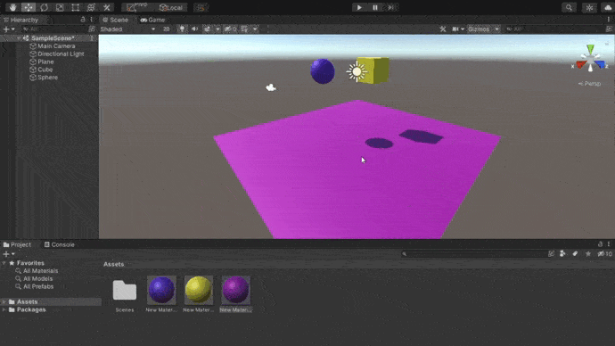

# Práctica 2: Introducción a los scripts en Unity 📌

### Esta práctica consiste en realizar tres ejercicios relacionados con los scripts en Unity.
-----------------------------------
 

### **Primer ejercicio**

1. Ninguno de los objetos es físico.
   
2. La esfera tiene físicas, el cubo no.
   
3. La esfera y el cubo tienen físicas.
   
4. La esfera y el cubo son físicos y la esfera tiene 10 veces la masa del cubo.
5. La esfera tiene físicas y el cubo es de tipo IsTrigger.
6. La esfera tiene físicas, el cubo es de tipo IsTigger y tiene físicas.
7. La esfera y el cubo son físicos y la esfera tiene 10 veces la masa del cubo, se impide la rotación del cubo sobre el plano XZ.

