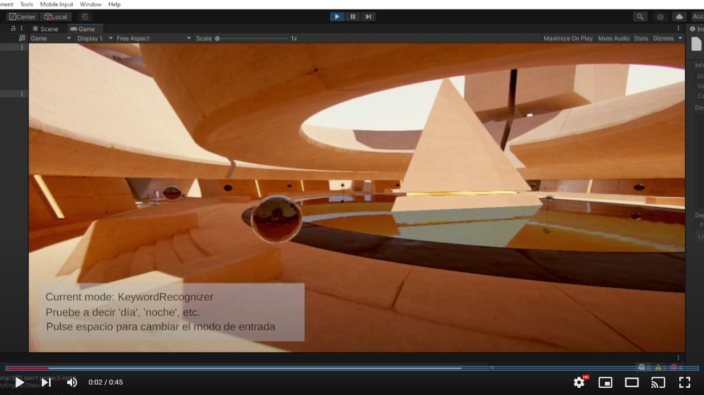

# Práctica 5: Reconocimiento de voz en Unity3D 📌

### Esta práctica tiene objetivo aplicar herramientas de reconocimiento de voz que Unity3D ofrece. 
-----------------------------------
<br />

### **Primer ejercicio - KeywordRecognizer**

Comenzaremos con instaciar un objeto *KeywordRecognizer*, al cuál se le pasará por parámetro una lista de palabras que representaran las palabras claves que queremos reconocer en la escena. Posteriormente se le intanciará un *callback* que contiene los pasos a seguir en el momento que se reconoce la palabra clase:

```cs
 private string[] m_Keywords = {"amanecer", "día", "tarde", "anochecer", "puesta de sol", "noche"};
    private KeywordRecognizer m_Recognizer;

    void OnEnable()
    {
        m_Recognizer = new KeywordRecognizer(m_Keywords);
        m_Recognizer.OnPhraseRecognized += OnPhraseRecognized;
        m_Recognizer.Start();
    }
```
Este *callback* se utiliza para obtener la coincidencia procesada por la voz de entrada, la cual pasa por un switch que establece en el gestor horario la hora que corresponde con la palabra clave que se ha conseguido capturar:
```cs
public TimeOfDayManager timeManager;

    private void OnPhraseRecognized(PhraseRecognizedEventArgs args)
    {
        Debug.Log(string.Format("{0}: {1}", args.text, args.confidence));
        switch (args.text)
        {
            case "amanecer":
                timeManager.time = 0.04f;
                break;
            case "día":
                timeManager.time = 0.15f;
                break;
            case "tarde":
                timeManager.time = 0.25f;
                break;
            case "puesta de sol":
            case "anochecer":
                timeManager.time = 0.35f;
                break;
            case "noche":
                timeManager.time = 0.4f;
                break;
            default:
                Debug.LogError("¡Caso no definido en el switch!");
                break;
        }
    }
```
Cuando el usuario cambia el modo del juego, se liberan los recursos del sistemas utilizados por el método de captura de voz. Para ello, se incluye el método *OnDisable()*:
```cs
void OnDisable()
    {
        m_Recognizer.Stop();
        m_Recognizer.Dispose();
        PhraseRecognitionSystem.Shutdown();
    }
```
### **Segundo Ejercicio - DictationRecognizer**

Se crea un objeto del tipo de la clase y se le asignan cuatro *callbacks* diferentes. Estos jugaran el papel de invocadores según lo que suceda que están previamente definidos. En esta práctica se ha desarrollado la función *DictationResult*:
```cs
 m_Recognitions.SetText("");
        m_DictationRecognizer = new DictationRecognizer();

        m_DictationRecognizer.DictationResult += (text, confidence) =>
        {
            Debug.LogFormat("Dictation result: {0}", text);
            m_Recognitions.SetText(text);
        };
``` 
Y nuevamente, al cambiar de modo de juego es necesario liberar los recursos de esta funcionalidad:

```cs
void OnDisable()
    {
        m_DictationRecognizer.Stop();
        m_DictationRecognizer.Dispose();
    }
```
### **GameManager**

Se desarrolló una clase *GameManager* para que controlace la lógica que controla el modo del juego. Se comprueba si en cada frame se ha pulsado la barra *espaciadora*, cambiando de un modo a otro.

```cs
void Update()
    {
        if (Input.GetKeyDown("space"))
        {
            if (isDictation)
            {
                dictationInput.enabled = false;
                keywordInput.enabled = true;
                isDictation = false;
                m_Recognitions.SetText("");
                helpText.SetText(helpString);
                currentModeText.SetText(string.Format(currentModeTemplate, "KeywordRecognizer"));
            } 
            else
            {
                keywordInput.enabled = false;
                dictationInput.enabled = true;
                isDictation = true;
                helpText.SetText("");
                currentModeText.SetText(string.Format(currentModeTemplate, "DictationRecognizer"));
            }
        }    
    }
```
### **Funcionamiento**
El funcionamiento del código desarollado puede verse en el siguiente vídeo:

[](https://youtu.be/JhAJ4pX4dks)
--------------------
Esta práctica ha sido realizada por:
- Nerea Rodríguez Hernández 💻, alu0101215693@ull.edu.es, alumna de Ingenería Informática en la Universidad de La Laguna para la asignatura de Interfaces Inteligentes📚.
- Javier Correa Marichal 💻, alu0101233598@ull.edu.es, alumno de Ingenería Informática en la Universidad de La Laguna para la asignatura de Interfaces Inteligentes📚.